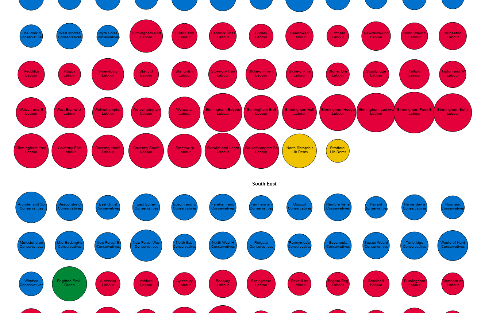

  

# 2024 General Election Constituency Bubble Chart

## Description

The diagram was developed using HTML, CSS, JavaScript, and D3.js. The data was taken from an MRP poll by the polling company YouGov showing projected results by parliamentary constituency for the 2024 general election. I wanted to create a bubble chart from the data provided to further my data visualisation skills.

## Deployment

The site is deployed on GitHub pages:

XX

## Acknowledgments

- https://tableconvert.com/excel-to-json for allowing me to seamlessly convert excel data to a javascript object.
